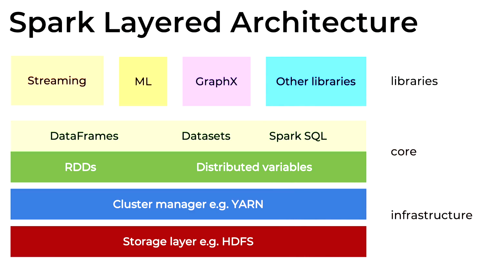

# Title

## Pre-watch questions
* what is spark core architecture?
* how does it work behind the scenes?

## Chunk 1
(only write concepts)
storage layer - infrastructure
cluster manager - infrastructure
rdds distributed variables - core
dataframes datasets spark sql - core
streaming ml graphx other libraries - libraries

worker nodes

executor - worker logical node (JVM) with isolated memory and cpu resources. Can be 0 or more on same physical machine.
driver - manage work between executors and gather their results. One per application
cluster manager - driver will interface with cluster driver. driver will request executors and resources from the cluster manager and then driver will make them do tasks.

for performance
* driver is close to the worker nodes (same physical rack or at least same LAN)
* worker nodes close to each other - otherwise shuffle is expensive

RDDs
dataframe
switching is expensive

lazy evaluation
planning
* physical plan
* logical plan
* optimizations
transformations
actions

job
stages
tasks

executors

## Chunk 1 converted
- the `3 main points`
- the `plain English explanation`
- `why it matters`
- `one example`

## Chunk 1 compressed
Concept: ...
Why it matters: ...
Example: ...
One confusion: ...
