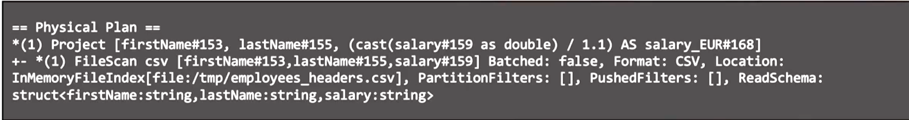
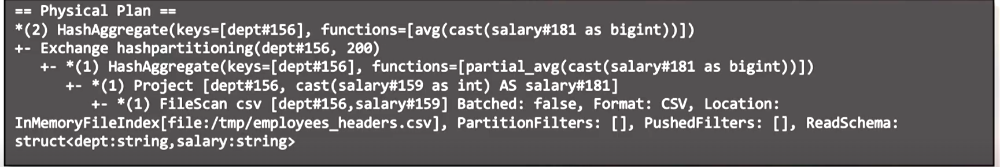
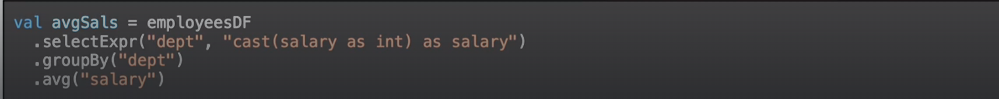
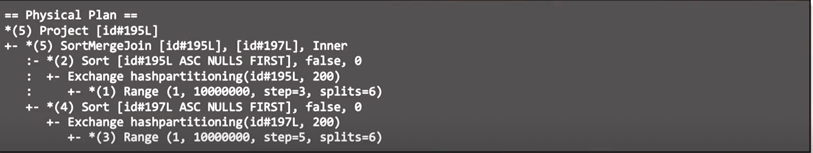
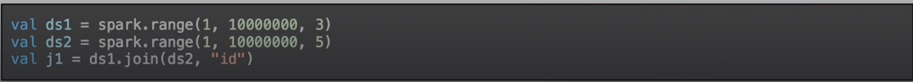

# Title

## Pre-watch questions
* What is spark used for?
* How does it work?
* Why do people use it?
* What are the best practices?

## Chunk 1
(only write concepts)

exchange
hashpartitioning
roundrobinpartitioning
sort
sortmergejoin
project
hashaggregate

## Chunk 1 converted
- the `3 main points`
- the `plain English explanation`
- `why it matters`
- `one example`

### Exercise 1

this spark job has only 1 stage
* filescan - it first reads a csv file with employees first name last name and salary
* project - then it reads the first name last name and converts the usd salary to euros

### Exercise 2

This spark job has 2 stages:
* stage 1
    * filescan - read from csv the department and salary
    * project - read the department and change salary to be int instead of string
    * hashaggregate - aggregate by department so for all departments with same id in same node get the partial average of salaries
* intermediate - hashpartition by department into 200 partitions
* stage 2 - do final full aggregate average of salaries by dept 

code:
1. read csv
2. cast salary to int
3. group by department and agg salary

actual code:

### Exercise 3

* This spark job has 5 stages
* stage 1 - 
    * we make a df from 1 to 1m steps of 3 and do it with 6 tasks
* exchange -
    * we hash partition by the int into 200 partitions
* stage 2 - we sort by the id asc
* stage 3 - another df from 1 to 1m steps of 5 split into 6 tasks
* exchange - we haspartition by the num into 200 partitions
* stage 4 - we sort by the num asc
* stage 5 - we do a sortmergejoin by that nums and then we keep only one of the nums ids.

Code:
1. create 2 df of ints
2. inner join the dataframes by same int

actual code:

### 3 main points
1. explain will show you the plan that spark will do. There is logical, physical and optimized logical plan.
2. The plan can be read bottom to top. Keywords include exchange - moving data, partitioning - hash and roundrobin - which is how we will partition data during exchanges, sort to sort data in partition, sortmergejoin - to join sorted parititions seen in join implementations.
3. Reading a query plan lets you know number of tasks (and thus partitions), number of stages and order of execution.

### Plain english
* we can read a plan to understand how our dataframe logic will actually get executed in a distributed manner by spark

## Chunk 1 compressed
Concept: Understanding and reading plans help you understand what spark will do in distributed manner
Why it matters: understanding the plan will help u identify what its doing and possibly show you what to optimize.
Example: You read the plan to understand that we spark will read data from tv shows in 200 paritions then repartition the data into 8 tasks, then read data about user playbacks, then join by title.
One confusion: spark will sometimes optimize so query plan can have some steps skipped.
