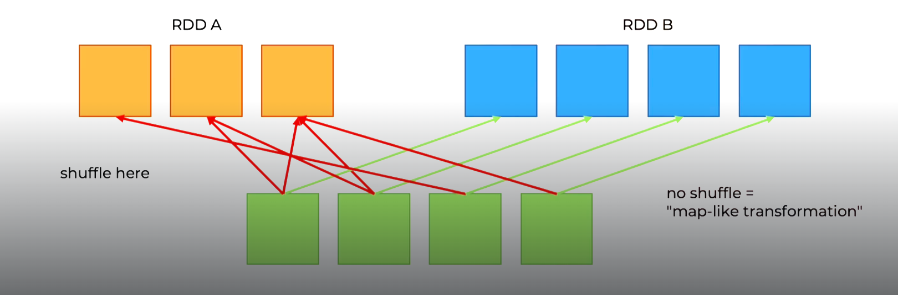
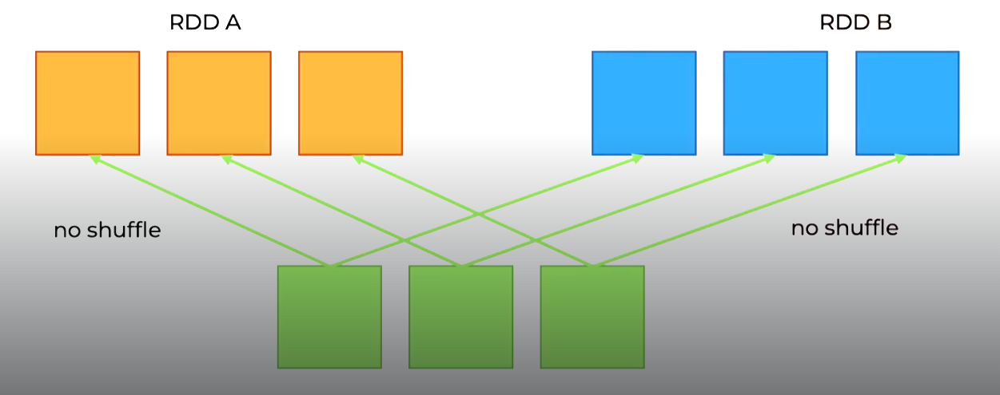
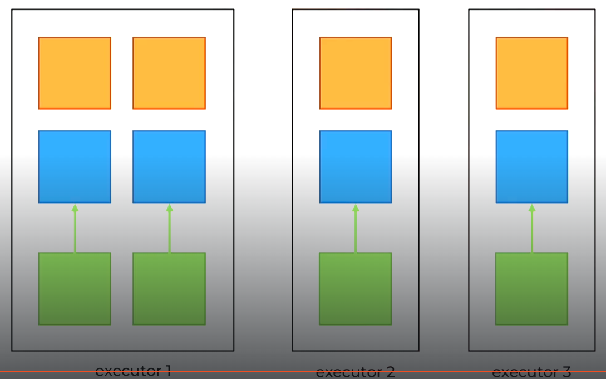

# Title

## Pre-watch questions

## Chunk 1
(only write concepts)

co-located rdd
co-partitioned rdds

partitioner

optimized join

optimized join +

optimized join ++

## Chunk 1 converted
- the `3 main points`
- the `plain English explanation`
- `why it matters`
- `one example`

### 3 main points
1. Co-located and co-partitioned. co-partitioned means two rdds share same partitioner, they can be in diff executors but have less overhead than w/o partioning information. Co-located means that the two rdd partitions live in the exact same executor
2. Optimized join - one rdd has a known partitioner and other is not known. So only one shuffle. 
3. Optimized join + - when both rdds are co-partitioned. this is narrow dependency so no shuffle needed.
4 - Optimized join ++ - both rdds to join are co-located. no network transfer and no shuffle.

### Plain english
By controlling partitioning during joins we can control if shuffle and network transfers are needed. We can do it through paritioner strategies either co-partitioned or co-located or knowing a partitioner before hand.
co-located simply is the partitions we want to join by are already in same machine. (no shuffle no network transfer)
co-partition simply is the partions we want to join by have same partitoning mapping already. (no shuffle but network transfer)

### Comparison breakdown

## Core idea

- **Co-partitioned** = both RDDs use the same **key -> partition rule**
- **Co-located** = corresponding partitions are on the same machine / near the compute

The ideal join case is:

- **co-partitioned**
- and also **co-located**

Because then:

- matching keys are already lined up
- and Spark does not need much network transfer

---

## 1) Non-co-partitioned join — slowest

Here the keys are **not lined up by partition**.

### Data layout

    RDD A                            RDD B
    -----                            -----

    Machine M1                       Machine M2
      Partition 0                      Partition 0
      (2, "book")                      (1, "CA")
      (4, "laptop")                    (3, "FR")

    Machine M2                       Machine M1
      Partition 1                      Partition 1
      (1, "pen")                       (2, "US")
      (3, "phone")                     (4, "UK")

### Why this is bad

    key 2 is in A.P0
    but key 2 is in B.P1

    key 1 is in A.P1
    but key 1 is in B.P0

So Spark cannot just do:

- A.P0 join B.P0
- A.P1 join B.P1

It must first **shuffle** data.

### Visual

    Before join:

    A rows  ----\
                 >--- SHUFFLE ---> regroup by key ---> join
    B rows  ----/

### Intuition

    wrong logical buckets
    -> Spark must move data around first
    -> slowest

---

## 2) Co-partitioned but not co-located — faster

Now both RDDs use the same partition rule.

Example rule:

- even keys -> partition 0
- odd keys  -> partition 1

### Data layout

    RDD A                            RDD B
    -----                            -----

    Machine M1                       Machine M2
      Partition 0                      Partition 0
      (2, "book")                      (2, "US")
      (4, "laptop")                    (4, "UK")

    Machine M2                       Machine M1
      Partition 1                      Partition 1
      (1, "pen")                       (1, "CA")
      (3, "phone")                     (3, "FR")

### Why this is better

Now the keys line up logically:

    key 2 -> partition 0 in both RDDs
    key 4 -> partition 0 in both RDDs
    key 1 -> partition 1 in both RDDs
    key 3 -> partition 1 in both RDDs

So Spark can do:

- partition 0 join partition 0
- partition 1 join partition 1

without a full reshuffle by key.

### Visual

    Machine M1 runs join for P0:
      local:  A.P0
      remote: B.P0 fetched from M2

    Machine M2 runs join for P1:
      local:  A.P1
      remote: B.P1 fetched from M1

### Intuition

    right logical buckets
    -> no full reshuffle by key
    -> but some remote reads still happen
    -> faster

---

## 3) Co-partitioned and co-located — fastest

This is the best case.

The keys line up **and** the matching partitions are on the same machine.

### Data layout

    RDD A and RDD B aligned on same machines
    ----------------------------------------

    Machine M1
      A.P0 = (2, "book"), (4, "laptop")
      B.P0 = (2, "US"),   (4, "UK")

    Machine M2
      A.P1 = (1, "pen"),  (3, "phone")
      B.P1 = (1, "CA"),   (3, "FR")

### Join execution

    Machine M1:
      join A.P0 with B.P0 locally

    Machine M2:
      join A.P1 with B.P1 locally

### Visual

    Machine M1                    Machine M2
    -----------                   -----------
    A.P0 + B.P0 -> join           A.P1 + B.P1 -> join

    no shuffle                    no shuffle
    no remote fetch               no remote fetch

### Intuition

    right logical buckets
    + physically nearby
    -> no reshuffle
    -> mostly local work
    -> fastest

---

## Quick comparison

    1. Non-co-partitioned
       wrong logical buckets
       -> shuffle required
       -> slowest

    2. Co-partitioned, not co-located
       right logical buckets
       -> no reshuffle by key
       -> some remote reads
       -> faster

    3. Co-partitioned + co-located
       right logical buckets
       -> no reshuffle
       -> mostly local reads
       -> fastest

---

## Memory hook

    co-partitioned = same logical buckets
    co-located     = those buckets are physically nearby

Best join case:

    same logical buckets + physically nearby

---

## Tiny row example

### Co-partitioned

    RDD A                         RDD B
    -----                         -----

    Partition 0                   Partition 0
    (2, "book")                   (2, "US")
    (4, "laptop")                 (4, "UK")

    Partition 1                   Partition 1
    (1, "pen")                    (1, "CA")
    (3, "phone")                  (3, "FR")

Spark can directly do:

- P0 join P0
- P1 join P1

### Non-co-partitioned

    RDD A                         RDD B
    -----                         -----

    Partition 0                   Partition 0
    (2, "book")                   (1, "CA")
    (4, "laptop")                 (3, "FR")

    Partition 1                   Partition 1
    (1, "pen")                    (2, "US")
    (3, "phone")                  (4, "UK")

Now Spark cannot directly do:

- P0 join P0
- P1 join P1

because matching keys are in different partitions.

So Spark must shuffle first.

## Chunk 1 compressed
Concept: Optimize your joins by controling the partitioning
Why it matters: can make joins faster by avoiding shuffles and/or network transfer.
Example: ...
One confusion: co-partition means two rdds share same partitioner, meanwhile co-located means two rdd partitions are already in same executor.

