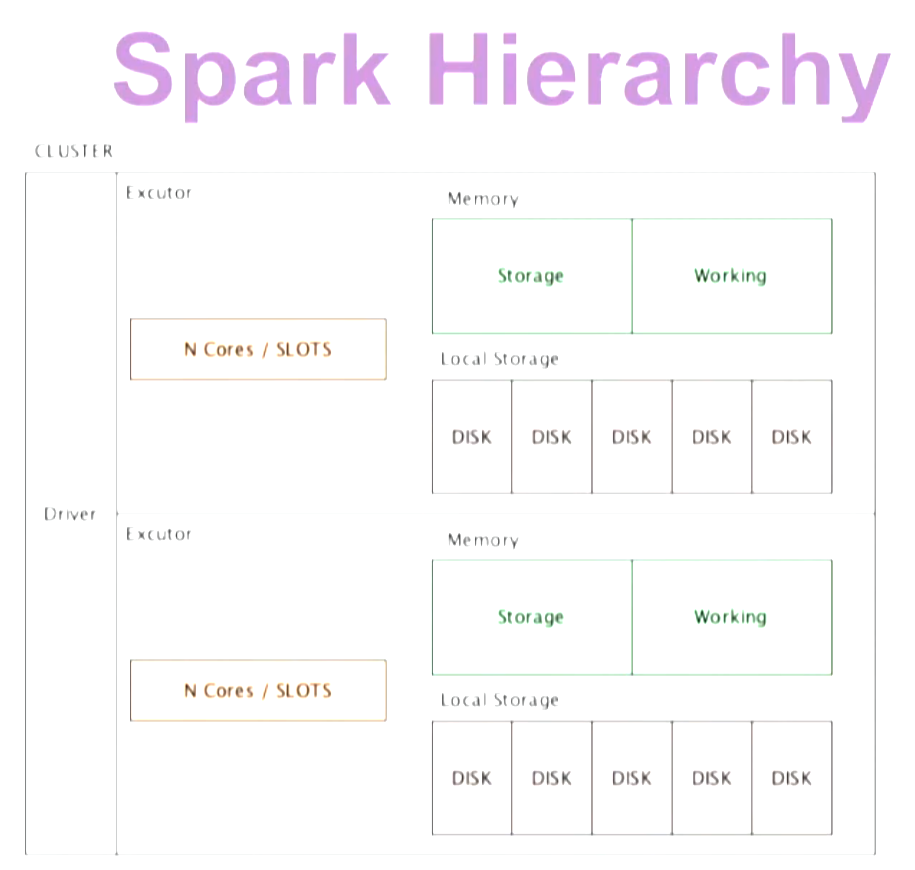
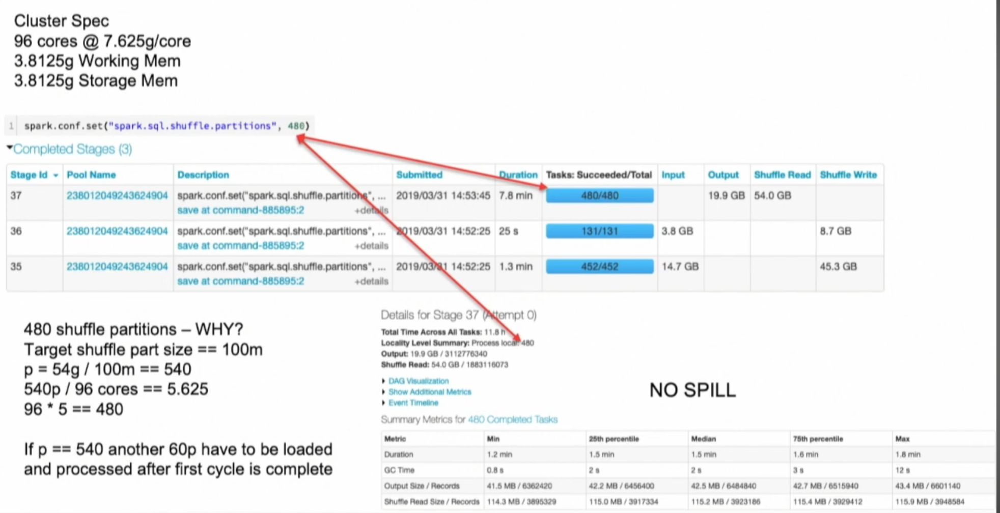
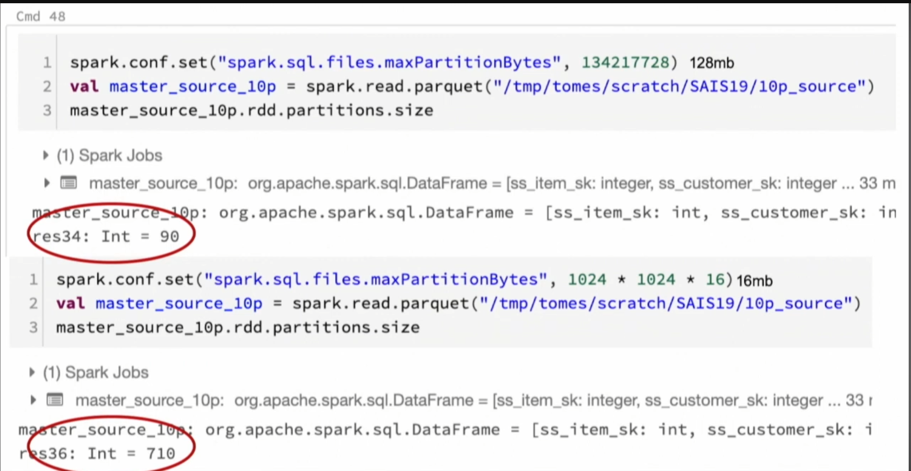
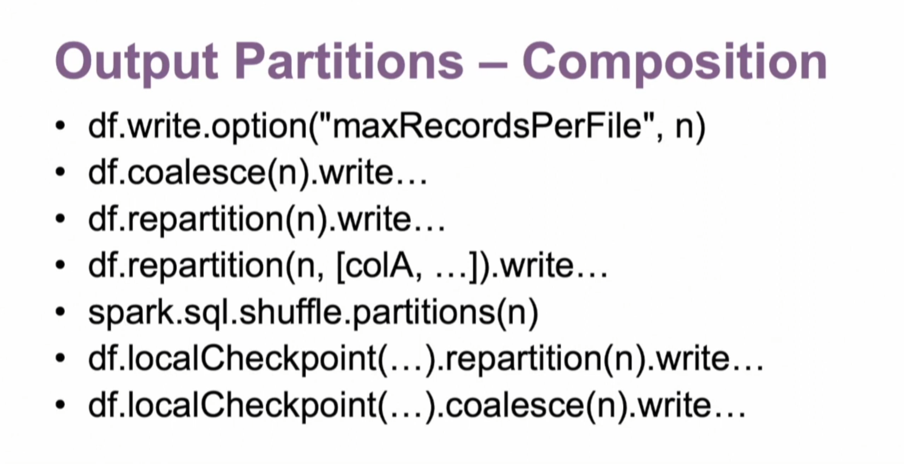

# Title
video: https://www.youtube.com/watch?v=_ArCesElWp8

## Pre-watch questions
* What is spark used for?
* How does it work?
* Why do people use it?
* What are the best practices?

## Chunk 1
(only write concepts)

task - partition - core 
stage summary metrics is very important and you want to see balance here
executors tab - has server level statistics
sql tab is very important.
* zoom out and try to see the big picture

Understand your hardware
* memory per core
* core count & speed
* etc

what to look for
* long stages
* spills 
* laggard tasks etc.
* cpu utilization (70% or above) you can use ganglia report

minimize data scans (lazy load/partition pruning)
* we can see large improvements doing this
* try to minimize data that you are reading with partition range using a filter on hive partitioned columnd
* only read data needed use partitions etc
* if you see in sql tab number of files read you should try to minimize this to the min needed

spark partition types
* input
 * controls - size
    * spark.sql.files.maxPartitionBytes (mutable) 
* shuffle
 * control - count
    * spark.sql.shuffle.partitions (defaults to 200 but should change this)
* output
 * control - size
    * coalese(n) to shrink
    * repartition(n) to increase and/or balance
    * df.write.option("maxRecordsPerFile", N)

Optimize shuffle partitions
* default is 200 but they do not know why its 200 and its not very good
* formula to find it
* shuffle partition count = stage input data / target size
* target size 100-200 mb
* example
* shuffle stage input = 210 gb
* x = 21000 MB / 200 MB = 1050
* good to divide result into the core count, its better to have a whole number for that division so can adjust based on that as seen in screenshot below
* this formula is just a guideline you should adjust based on use case for example trying to maximize cluster utilization might mean lowering partitions (see screenshot below instead of 540 wee use 480)
* spark.conf.set("spark.sql.shuffle.partitions", 1050)
* but -> is cluster has 2000 cores, we want to use whole cluster so maybe just set it to full
* spark.conf.set("spark.sql.shuffle.partitions", 2000)
* get the shuffle stage input with shuffle read param
    * if it did not complete you  can just see the shuffle write of previous stages that write to this stage and sum those shuffle writes up that should be the shuffle read of the current stage
* if you see shuffle spill then this is bad and maybe means you do not have good partition size

input partitions - spark.conf.set("spark.sql.files.maxPartitionBytes", 16777216)
* use spark defaults (128 mb) unless...
    * increase parallelism
    * heavily nested/repetive data
    * generating data - i.e explode
    * source structure is not optimal (upstream)
    * UDFs
    

)

Output partitions - right sizing
* write once - read many
    * more time to write but faster to read
* perfect writes limit parallelism
    * compactions (minor & major)
* repartition - usually only use it to go up and use coalesce to go down. unless you are rebalancing

Partitions TLDR 
* avoid the SPILL
* maximize parallelism
    * utilize all cores
    * provision only the cores you need

## Chunk 1 converted
- the `3 main points`
- the `plain English explanation`
- `why it matters`
- `one example`

## Chunk 1 compressed
Concept: ...
Why it matters: ...
Example: ...
One confusion: ...
